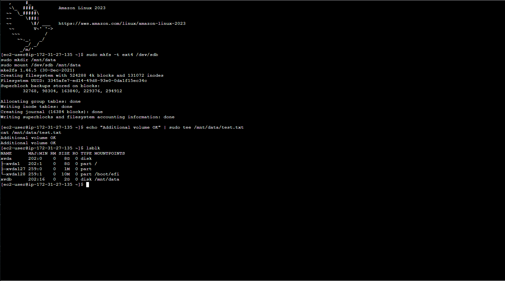

# Attach EBS Volume to EC2 (Amazon Linux 2023)

## Description
This project demonstrates how to attach and mount an additional EBS volume to an EC2 instance running Amazon Linux 2023.

## Setup Steps

1. Launch an EC2 instance (Amazon Linux 2023).
2. Create and attach a new EBS volume (e.g., 2 GiB) in the same Availability Zone.
3. Connect to the EC2 instance using EC2 Instance Connect.
4. Run the following commands:

```bash
sudo mkfs -t ext4 /dev/sdb
sudo mkdir /mnt/data
sudo mount /dev/sdb /mnt/data
echo "Additional volume OK" | sudo tee /mnt/data/test.txt
cat /mnt/data/test.txt
lsblk

